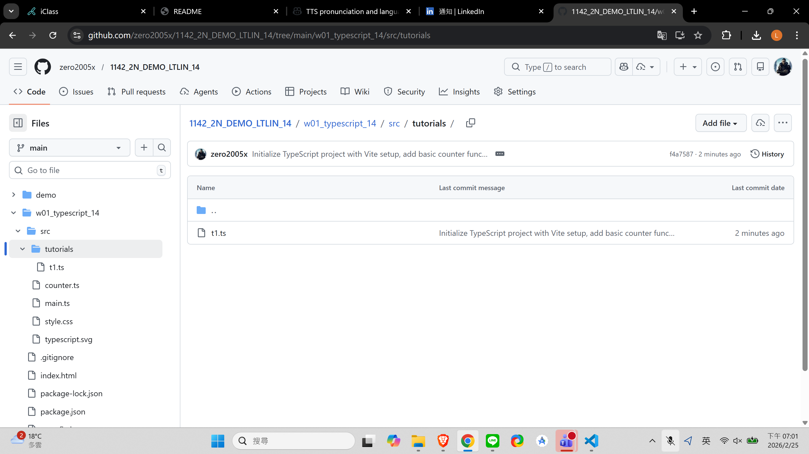
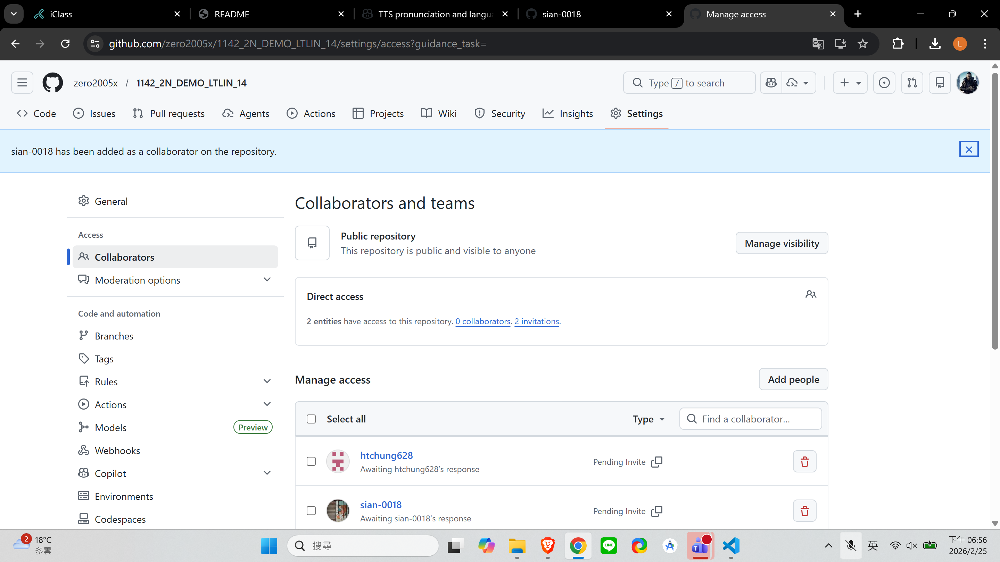
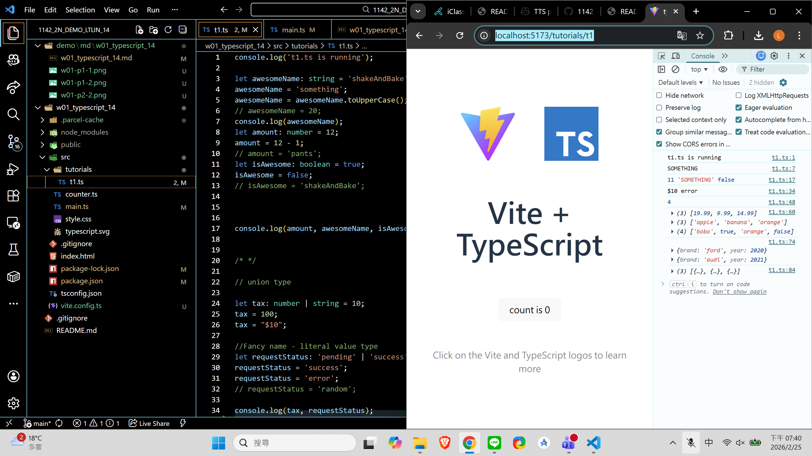
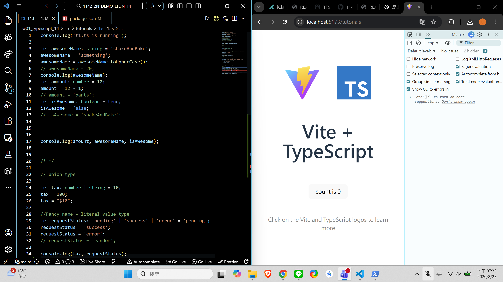
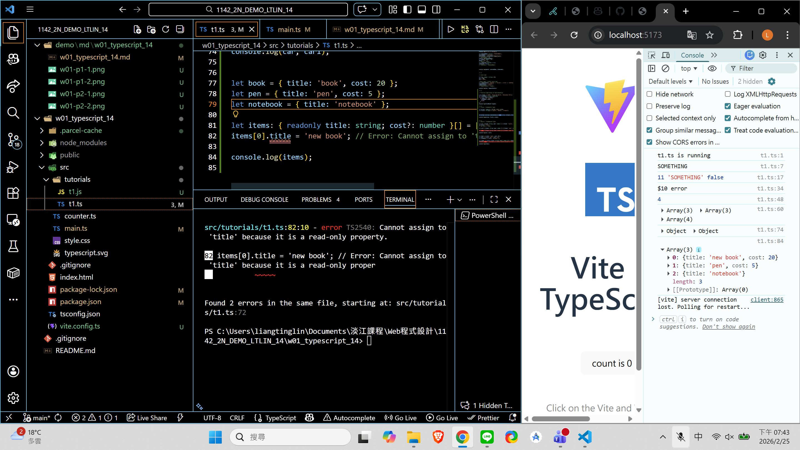
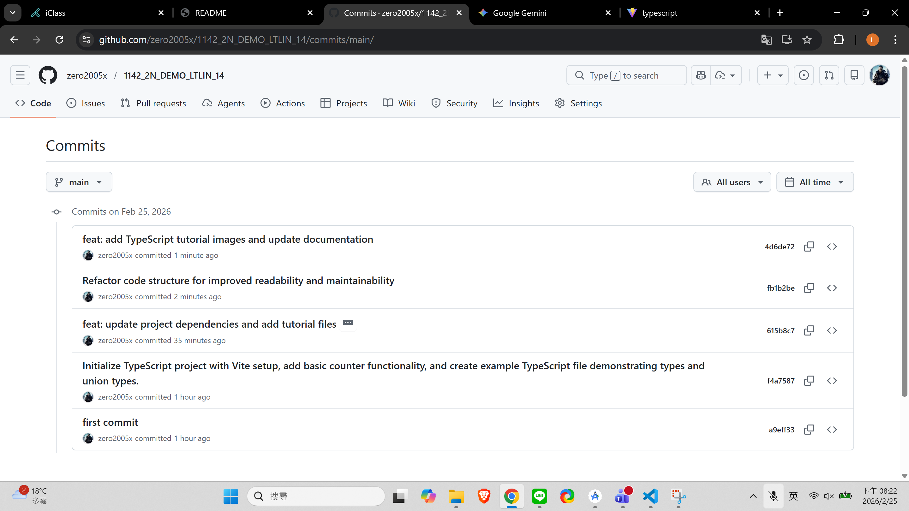

[Github URL](https://github.com/zero2005x/1142_2N_DEMO_LTLIN_14)

### W01-P1: Setup Github

#### => Github demo URL



#### => share to the teacher and TA



```
Wed Feb 25 18:50:47 2026 +0800 Initialize TypeScript project first commit
```

### W01-P2:TypeScript tutorials (1)

#### => Type Annotation and Union Type





#### =>

```
Wed Feb 25 18:59:11 2026 +0800
with Vite setup, add basic counter functionality, and create example TypeScript file demonstrating types and union types.
```

### W01-P3: TypeScript tutorials (2)

#### => Object Fundamental, npm run build error when typechecking failed



```
Wed Feb 25 19:47:53 2026 +0800 feat: update project dependencies and add tutorial files
```

### W01-logs: git logs of W01


