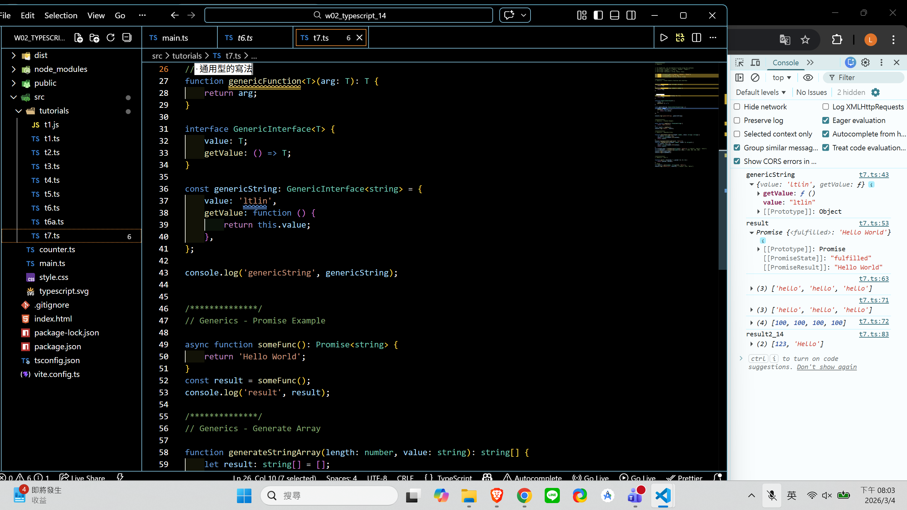
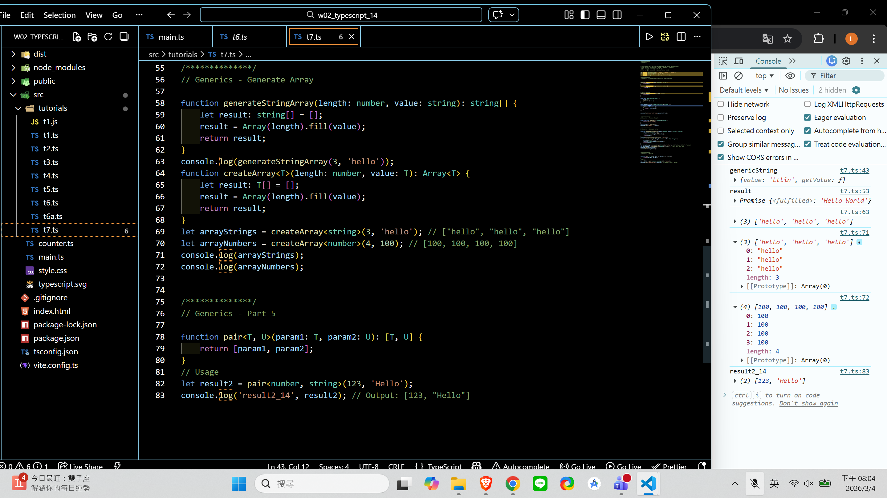
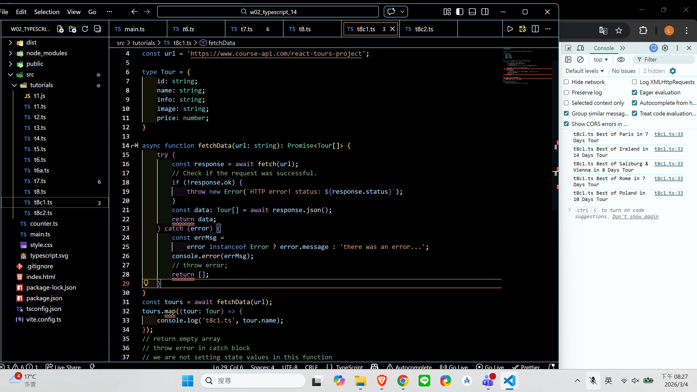
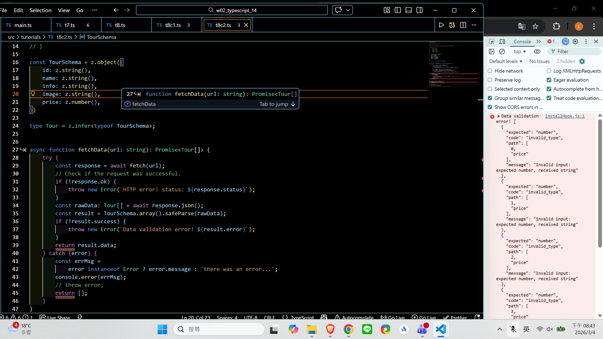
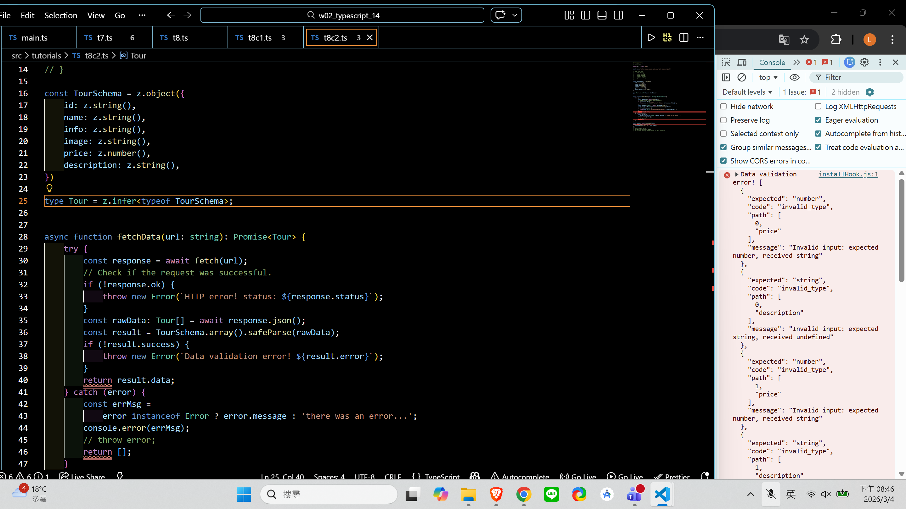

[Github URL](https://github.com/zero2005x/1142_2N_DEMO_LTLIN_14)

### w02-P1: Type Alias Demo in t3.ts

#### =>


```
e3d52ec zero2005x       Wed Mar 4 18:41:27 2026 +0800   w02-P1: Type Alias Demo in t3.ts
```

### w02-P2: Type Alias Demo in t3.ts


```
57cb616 zero2005x       Wed Mar 4 19:11:20 2026 +0800   w02-P2: Type Alias Demo in t3.ts
```

### W02-P3: Interface Demo in t5.ts


```
3865699 zero2005x       Wed Mar 4 19:28:04 2026 +0800    W02-P3: Interface Demo in t5.ts
```

### W02-P4: Modules - import and export in t6.ts and t6a.ts


```
9cecda5 zero2005x       Wed Mar 4 20:07:08 2026 +0800   W02-P4: Modules - import and export in t6.ts and t6a.ts
```

### W02-P5: Generics Demo in t7.ts

#### => interface GenericInterface<T>



#### => createArray<T>(length: number, value: T): Array<T>



```
787f22b zero2005x       Wed Mar 4 20:10:57 2026 +0800   W02-P5: Generics Demo in t7.ts
```

### W02-P6: Fetch Data Demo in t8.ts, t8c1.ts, t8c2.ts

#### => add Tour type



#### => use zod to validate data (success)



#### => user zod to validate data (invalid data)



```
fc71d6d zero2005x       Wed Mar 4 20:47:53 2026 +0800   W02-P6: Fetch Data Demo in t8.ts, t8c1.ts, t8c2.ts
```

### w02-logs: git logs of w02


