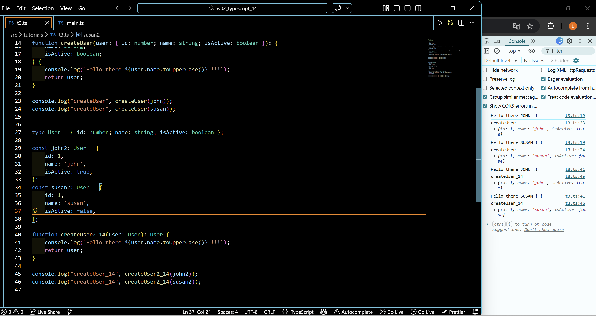
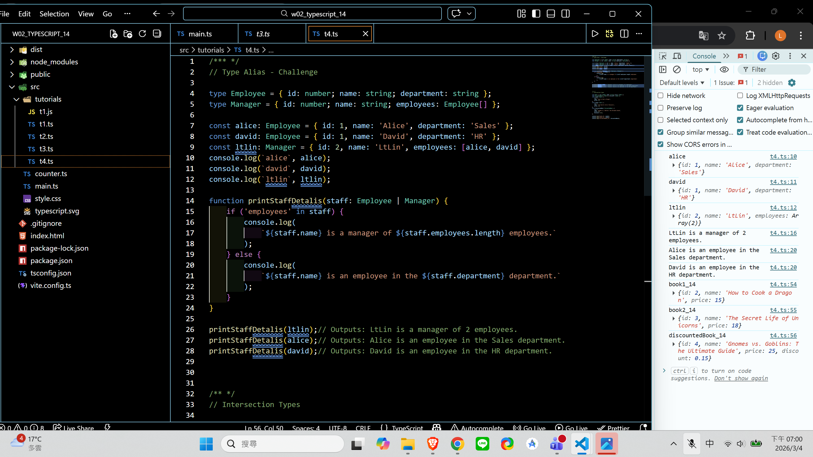
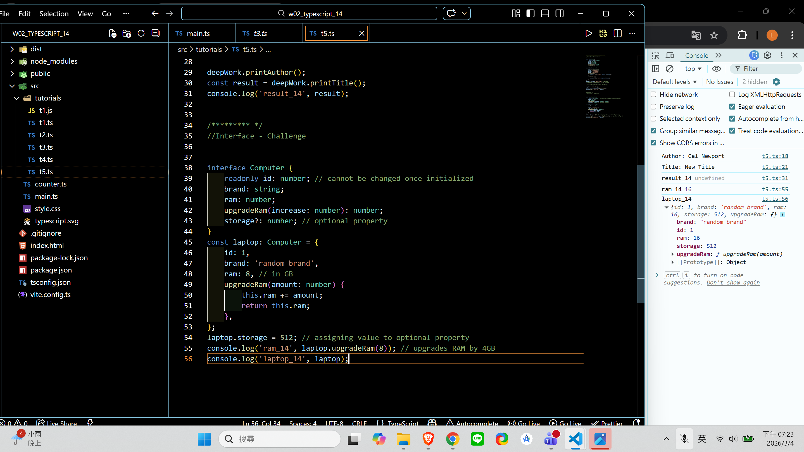
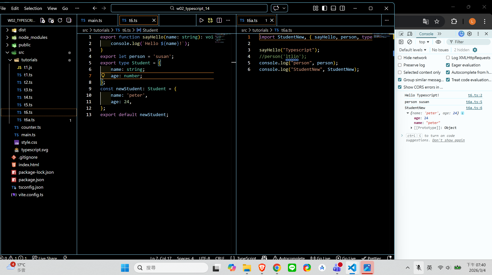
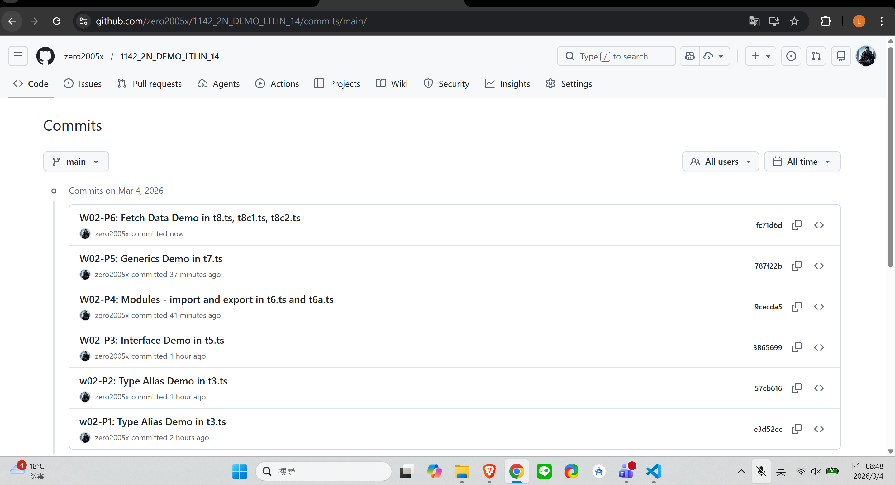

[Github URL](https://github.com/zero2005x/1142_2N_DEMO_LTLIN_14)

### w02-P1: Type Alias Demo in t3.ts

#### =>



```
e3d52ec zero2005x       Wed Mar 4 18:41:27 2026 +0800   w02-P1: Type Alias Demo in t3.ts
```

### w02-P2: Type Alias Demo in t3.ts



```
57cb616 zero2005x       Wed Mar 4 19:11:20 2026 +0800   w02-P2: Type Alias Demo in t3.ts
```

### W02-P3: Interface Demo in t5.ts



```

```

### w02-P4:

#### =>



```

```

### w02-logs: git logs of w02


