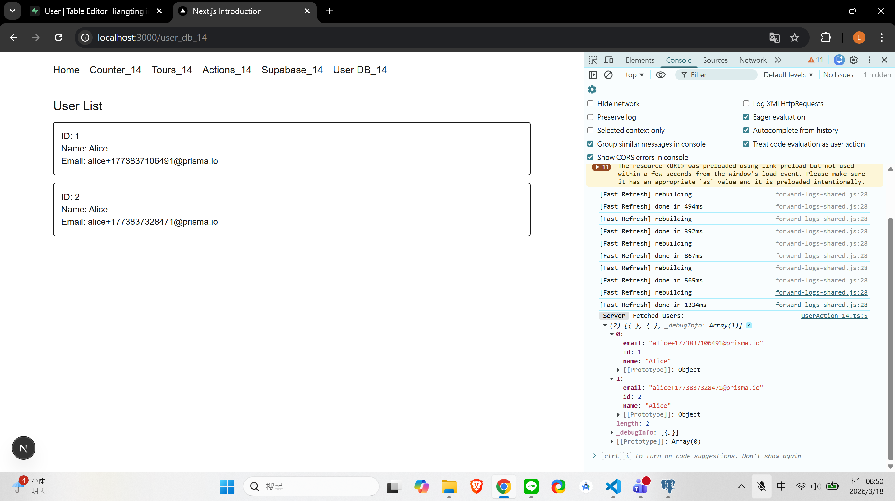
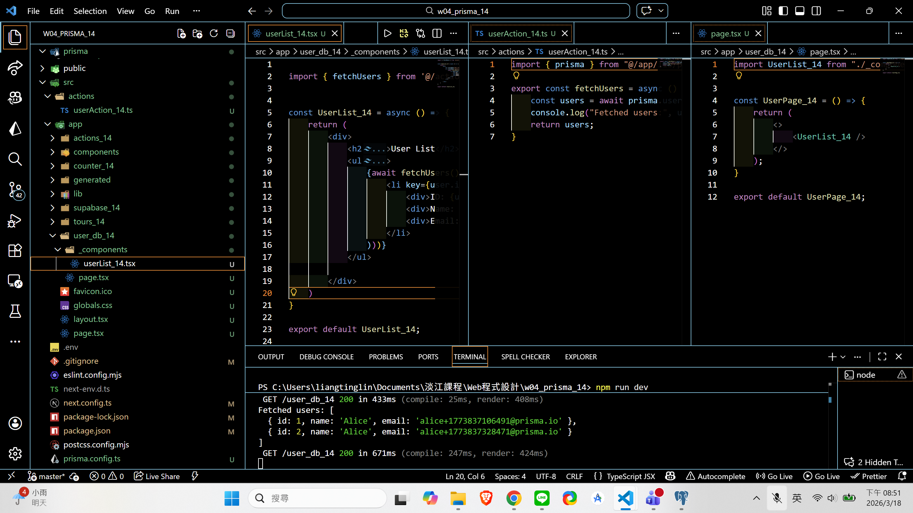

[Github URL](https://github.com/zero2005x/1142_2N_DEMO_LTLIN_14)

### W04-P1: Create tables and data using Prisma with Studio

#### => npx prisma db push


#### => add one user (your info), show in Prisma Studio and pgAdmin


```
53270c0 zero2005x       Wed Mar 18 20:38:19 2026 +0800  W04-P1: Create tables and data using Prisma with Studio
```

### w04-P2: W04-P2: Repeat W04-P1, but work on Supabase

#### => connection setting in Supabase


#### => reset database password in Supabase


#### => npx prisma db push & run test.ts to add 1 user with 1 post


```
20802b5 zero2005x       Wed Mar 18 20:54:23 2026 +0800  w04-P2: W04-P2: Repeat W04-P1, but work on Supabase
```

### W04-P3: implement User_db_xx using server action

#### => Chrome, show 2 users fetch from Supabase



#### => show the code, the concept of server action



```

```

### w04-logs: git logs of w04


