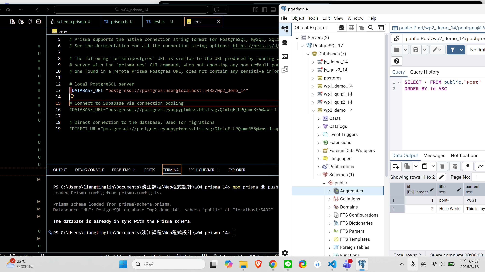
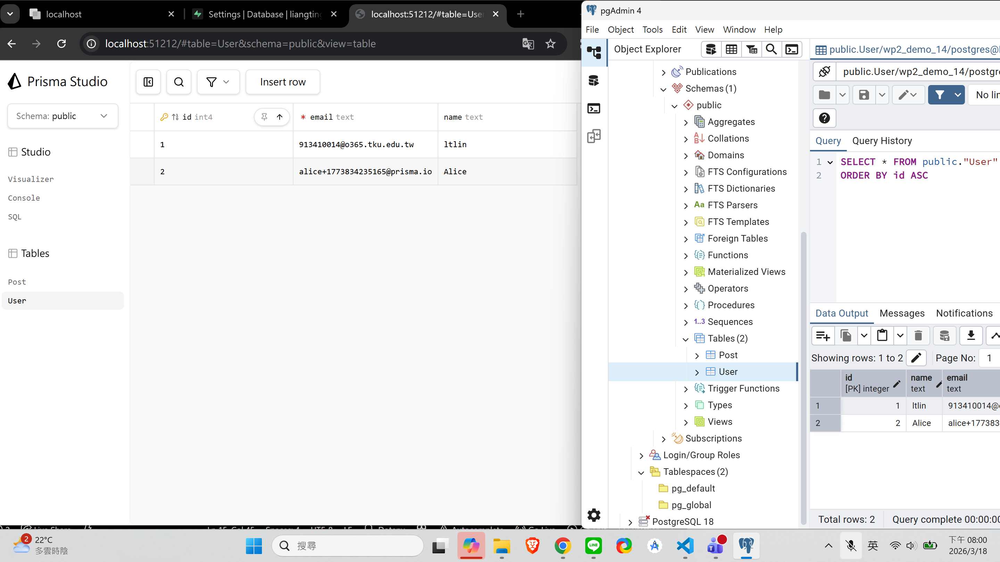
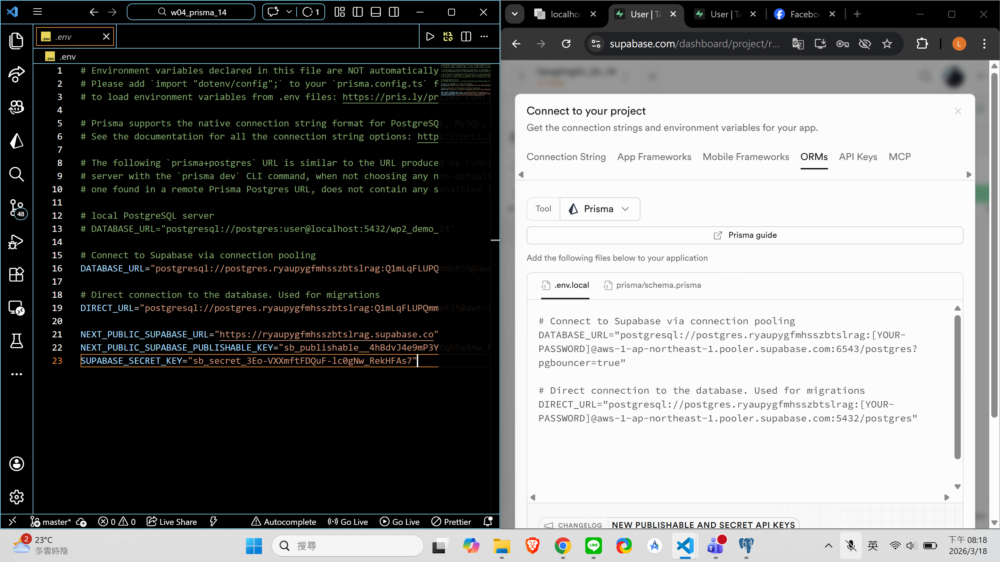
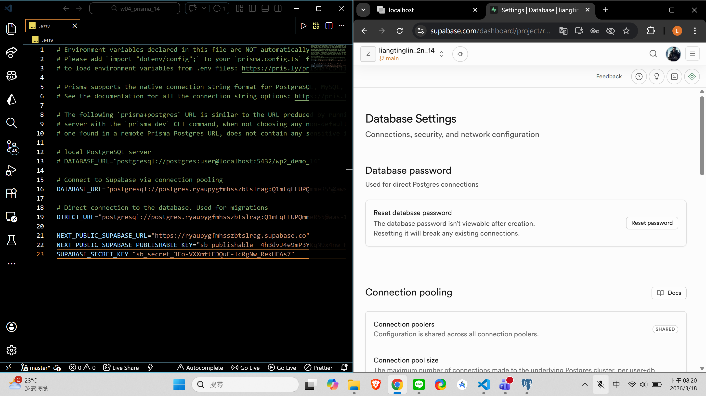
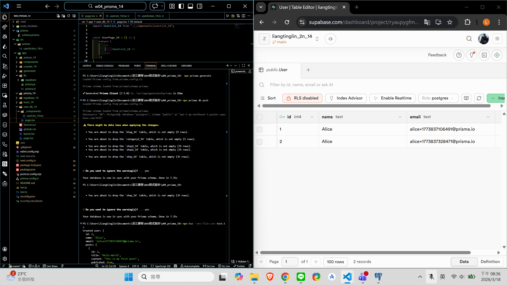
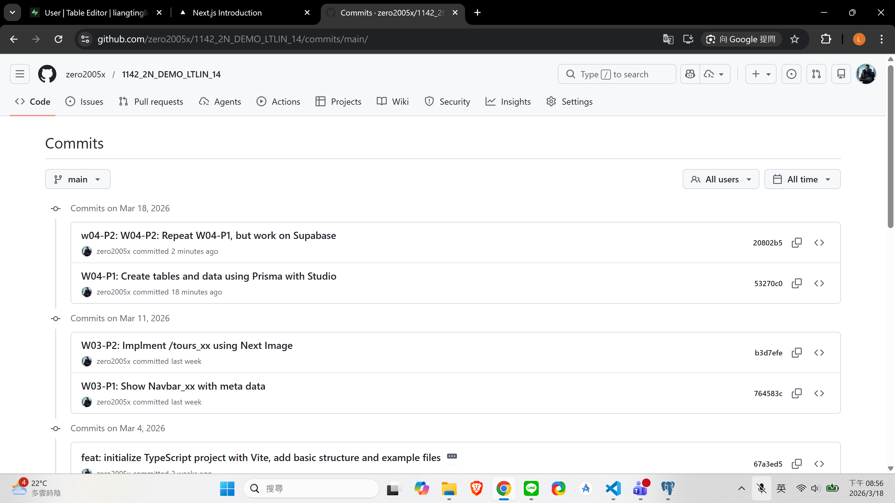

[Github URL](https://github.com/zero2005x/1142_2N_DEMO_LTLIN_14)

### W04-P1: Create tables and data using Prisma with Studio

#### => npx prisma db push



#### => add one user (your info), show in Prisma Studio and pgAdmin



```

```

### w04-P2: W04-P2: Repeat W04-P1, but work on Supabase

#### => connection setting in Supabase



#### => reset database password in Supabase



#### => npx prisma db push & run test.ts to add 1 user with 1 post



```

```

### w04-logs: git logs of w04


