[Github URL](https://github.com/zero2005x/1142_2N_DEMO_LTLIN_14)
[Vercel URL](https://1142-vercel-ltlin-14.vercel.app/)

### W05-P1: Create a new Github repo and deploy to Vercel
 
#### => "npm run build" with success
 
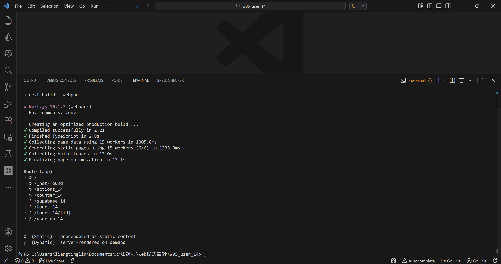
 
#### => Deploy to Vercel, add env variables
 
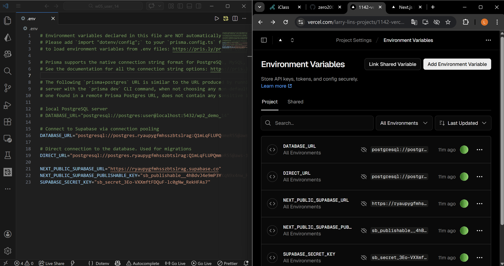
 
#### => Show users fetch from Supabase
 
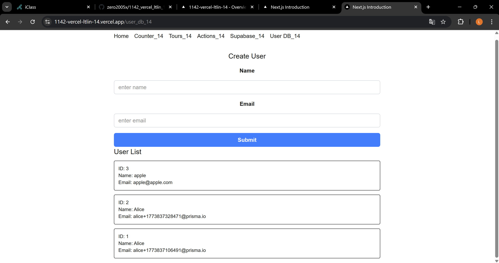
 
#### => Github repo with Vercel link
 
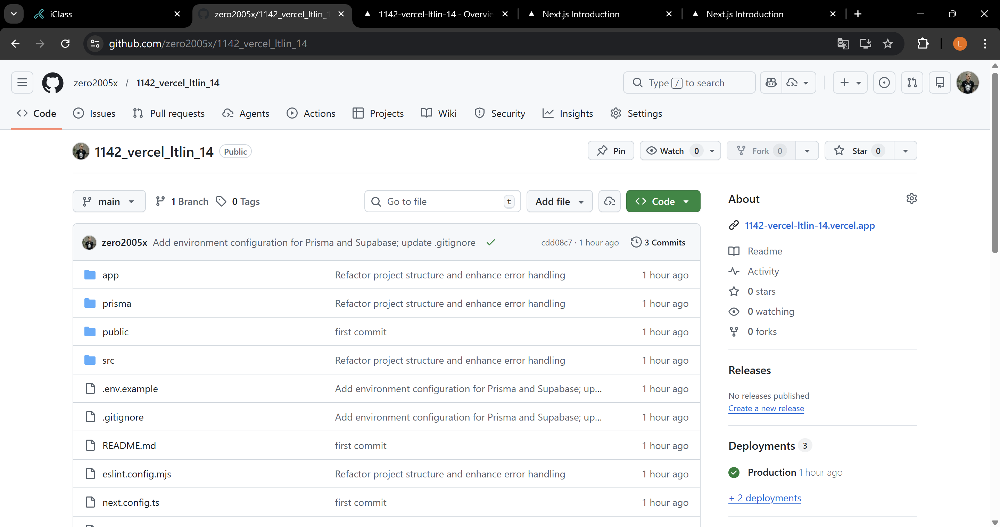
 
```
5bee43b zero2005x       Wed Mar 25 20:51:33 2026 +0800  W05-P1: Create a new Github repo and deploy to Vercel
```

### W05-P2: Create User using server action
 
#### => input an user and save it to Supabase
 
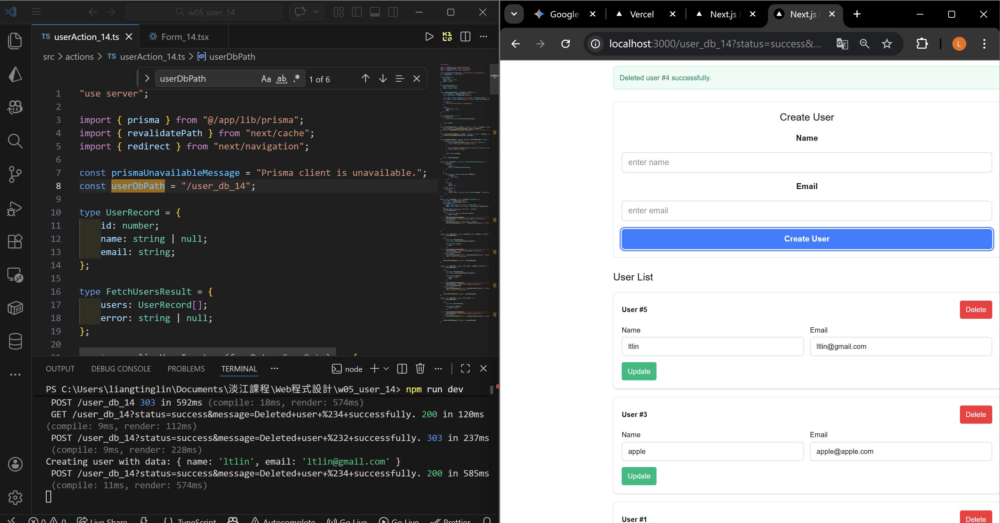
 
#### => show how formData works
 
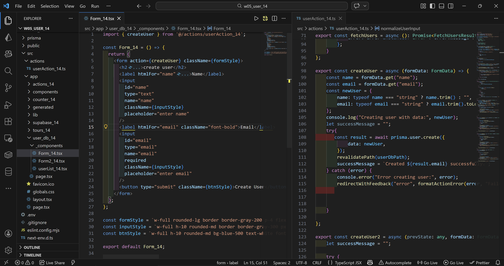
 
```
6c0acb8 zero2005x       Thu Mar 26 16:17:10 2026 +0800  W05-P2: Create User using server action
```

### W05-P3: Delete an user from Supabase
 
#### => from console.log show an user being deleted
 
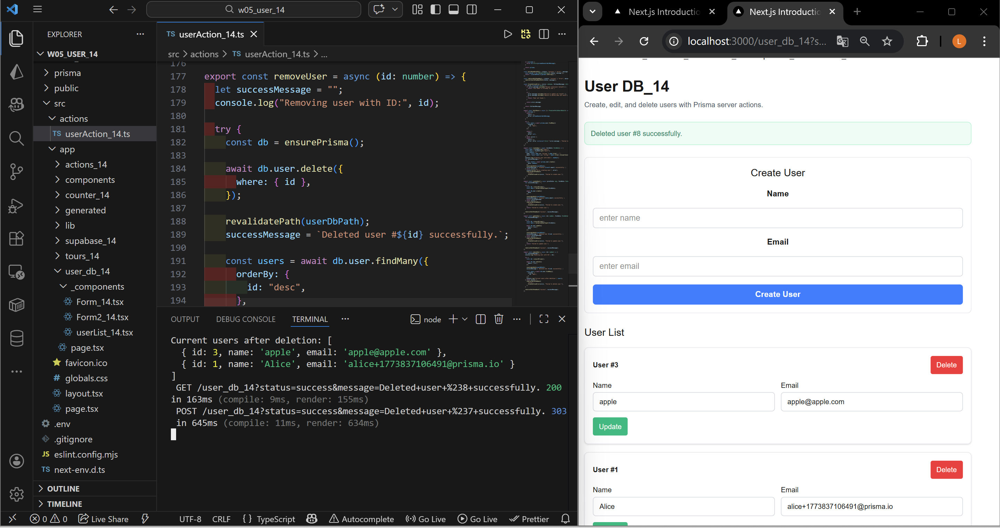
 
#### => show how code is working
 
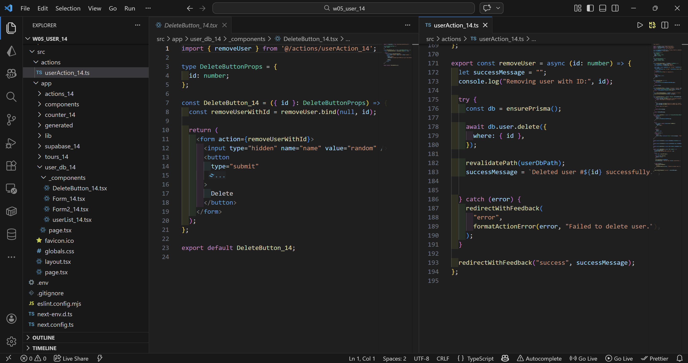
 

```

```

### W05-P4:Refine Form_xx using useFormStatus and useFormState
 
#### => create an user and show return message
 
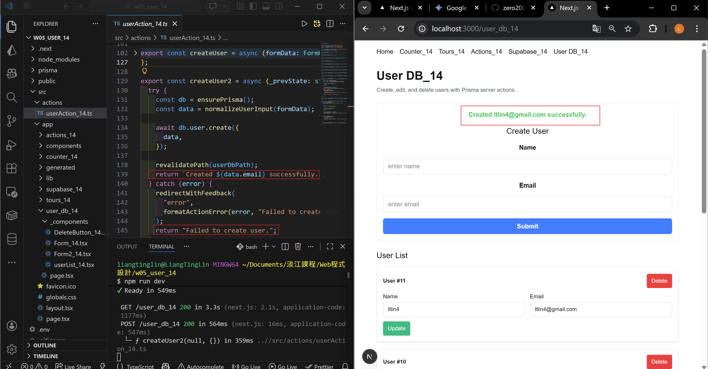
 
#### => show how code is working
 
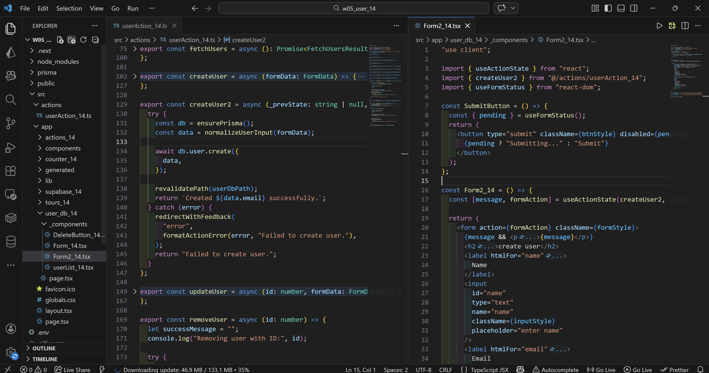
 

```

```


### W05-logs: git logs of W05

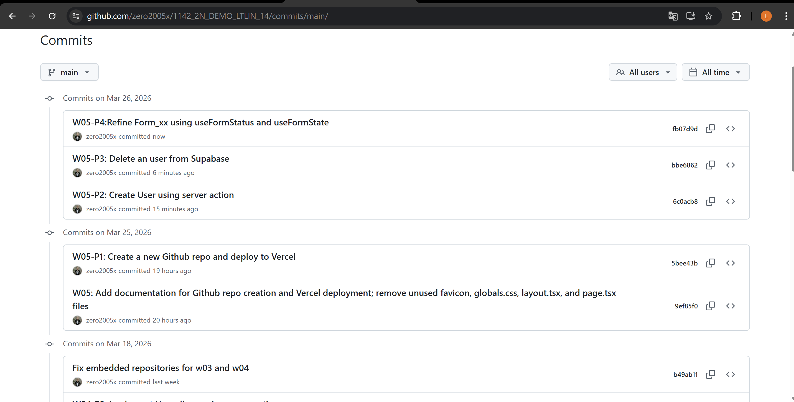
