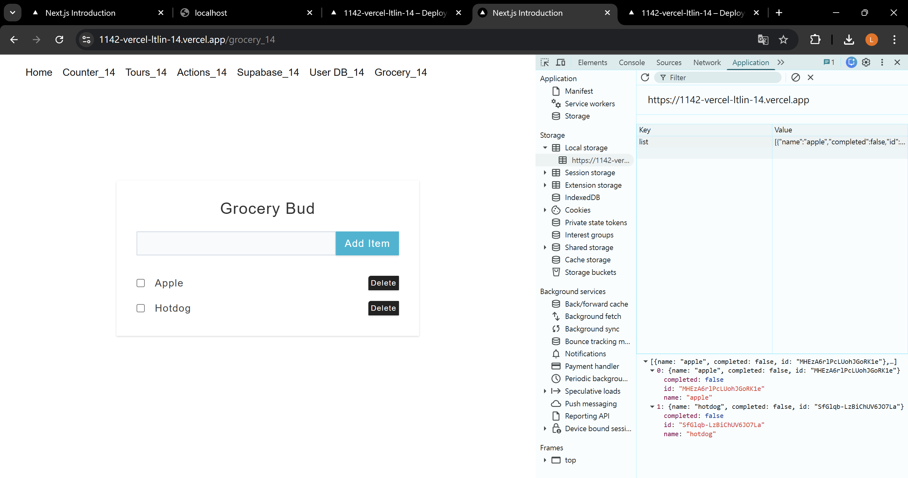
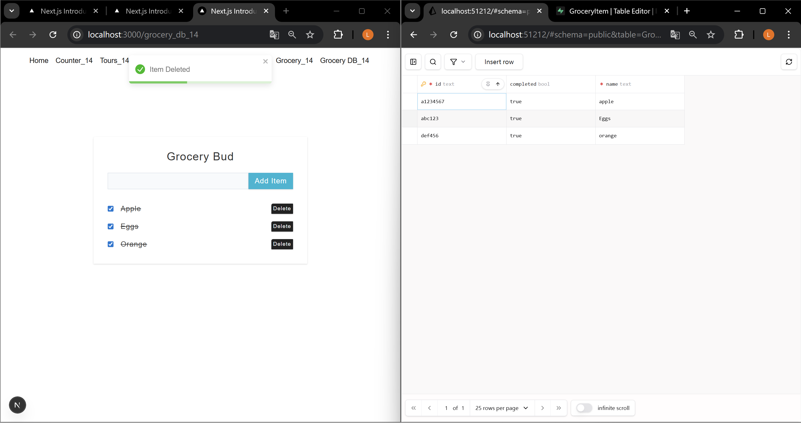
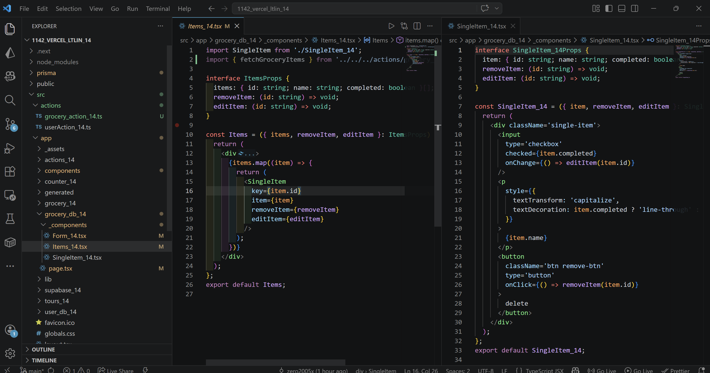
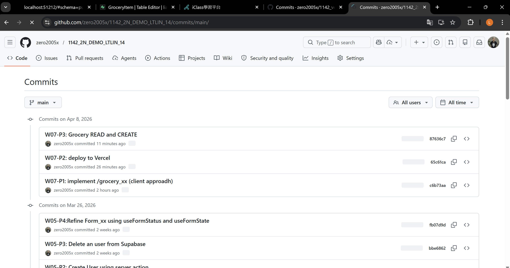

[Github URL](https://github.com/zero2005x/1142_2N_DEMO_LTLIN_14)
[Vercel URL](https://1142-vercel-ltlin-14.vercel.app/)

### W07-P1: implement /grocery_xx (client approadh)
 
#### => Add two items, and show the local storage
 

 

```

```

### W07-P2: 
 
#### =>
 

 
#### => 
 

 
```

```

### W07-P3: 
 
#### => 


 
#### =>


 

```

```

### W07-P4:

 
#### =>

 

 
#### => 

 

 

```

```


### W07-logs: git logs of W07


