[Github URL](https://github.com/zero2005x/1142_2N_DEMO_LTLIN_14)
[Vercel URL](https://1142-vercel-ltlin-14.vercel.app/)

### W11-P1: Clerk Setup and test
 
#### => Sign In using Github
 
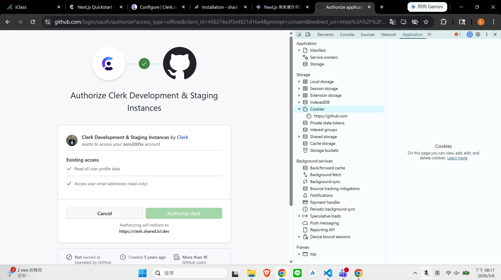
 
#### => get jwt token from Clerk
 
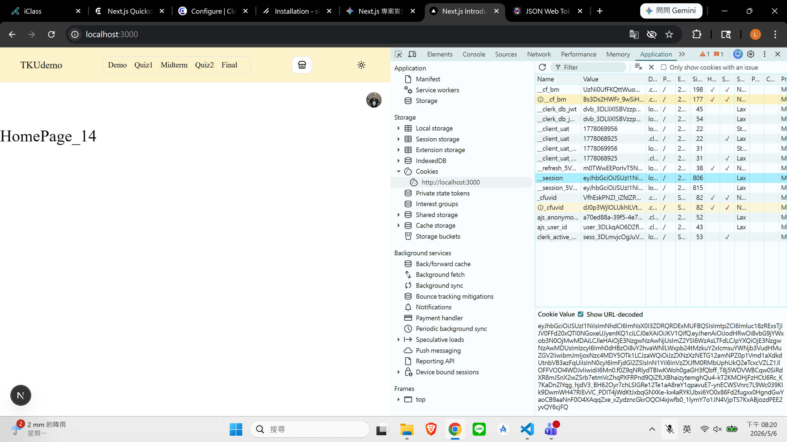
 
#### => verify jwt token from jwt.io
 
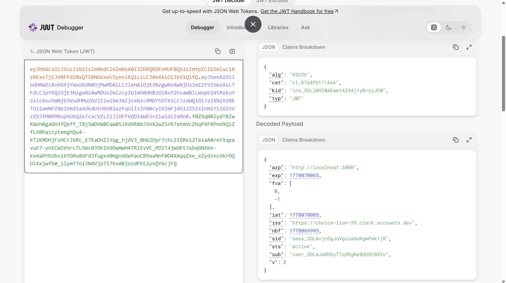
 
#### => get User_ID from Clerk
 
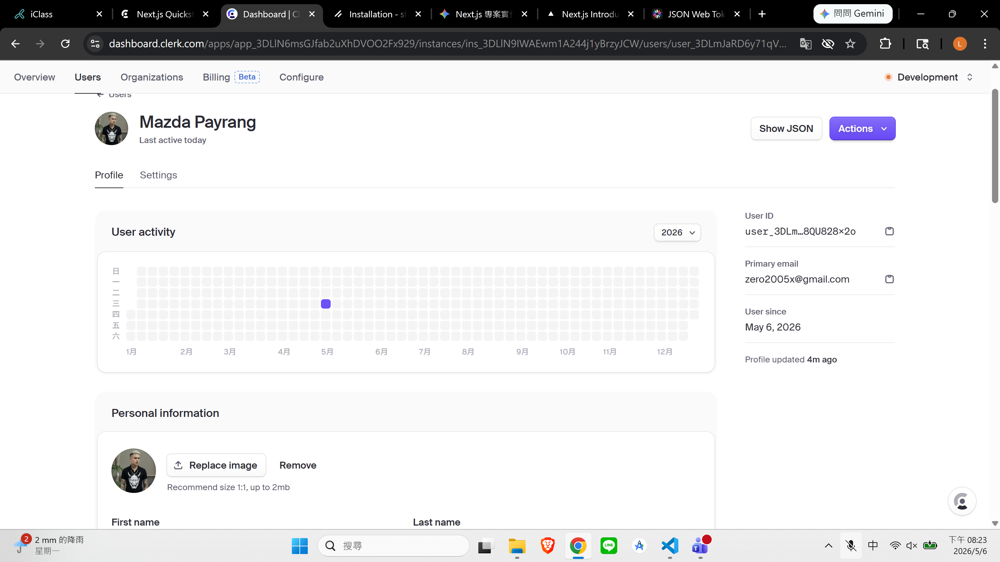
 
#### => set ADMIN_USER_ID using this User_ID
 
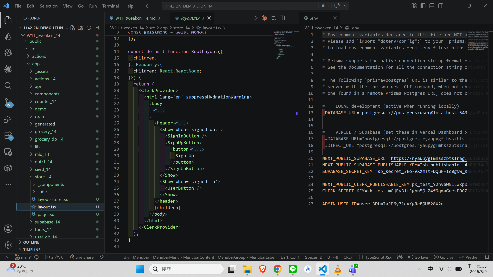

```

```

### W11-P2: Make code work in Vercel
 
#### => npm run build successfully
 
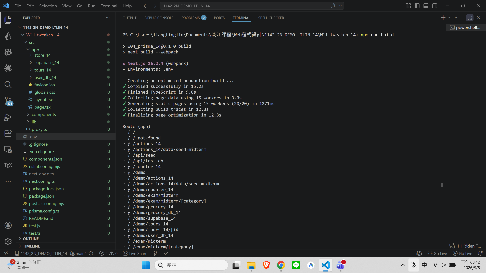
 
#### => add new env to Vercel
 
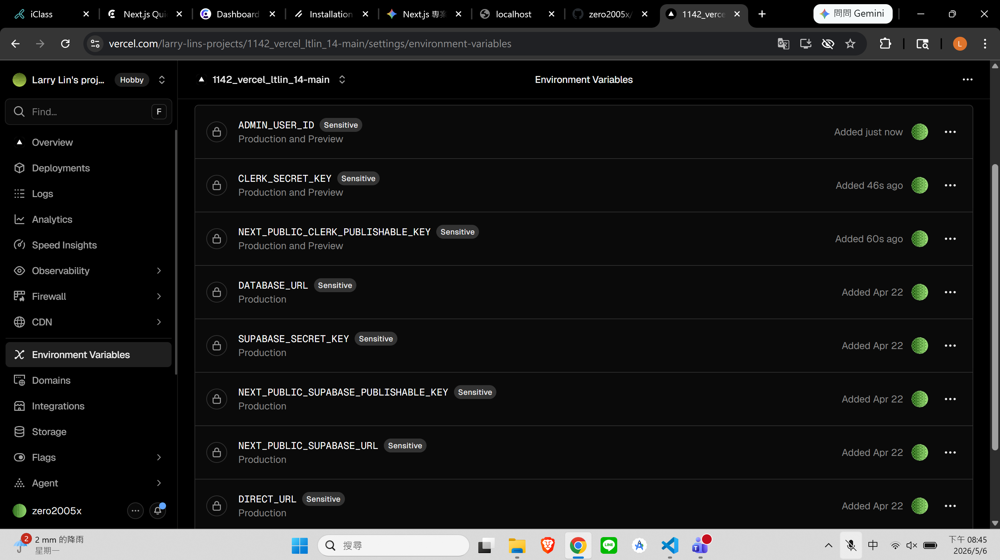
 
#### => test in Vercel, not yet login
 
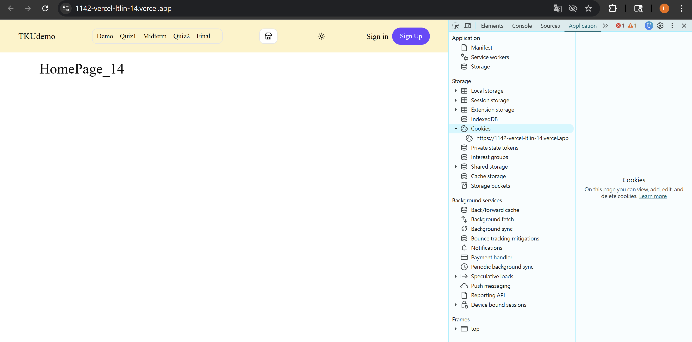
 
#### => test in Vercel, login and get jwt token
 
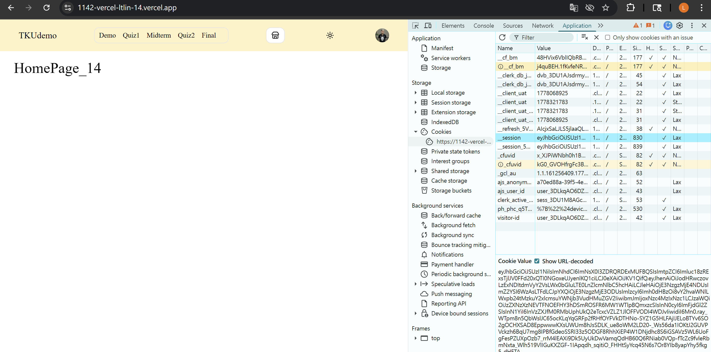

```

```

### W11-P3: Make /mid_14 to work in Vercel
 
#### => show Mens products
 
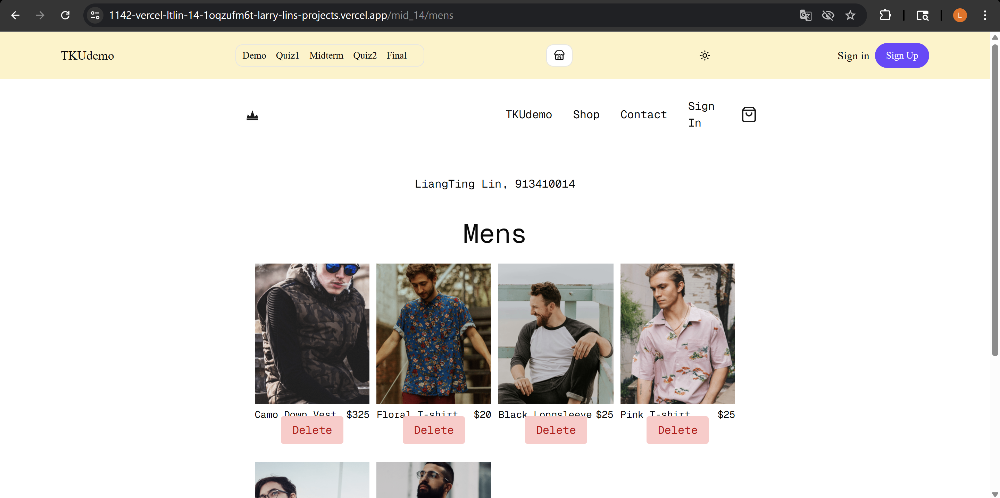


```

```


### w11-logs: git logs of w11

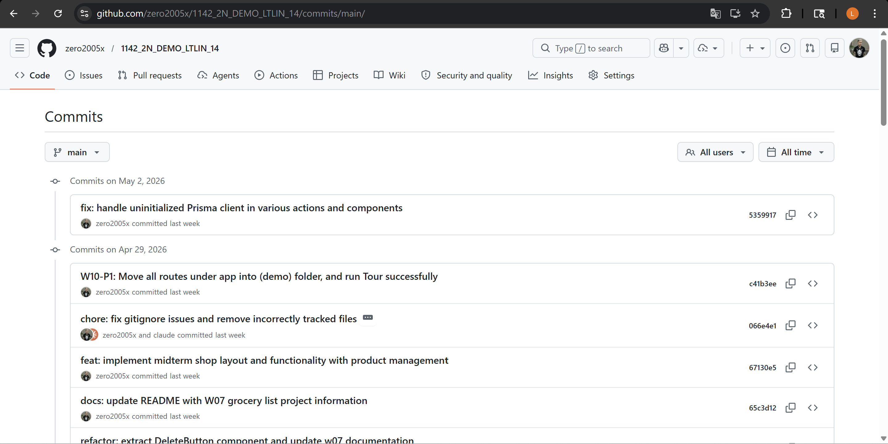
