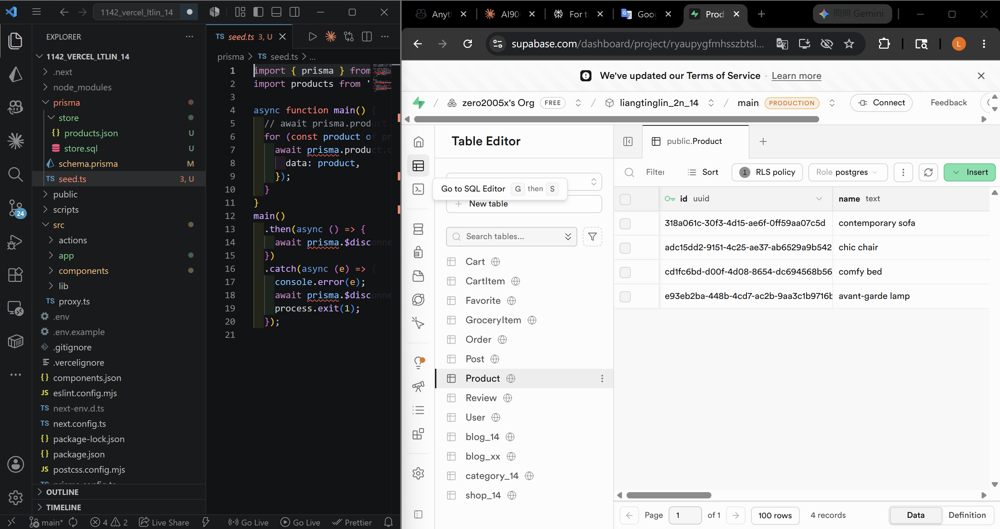
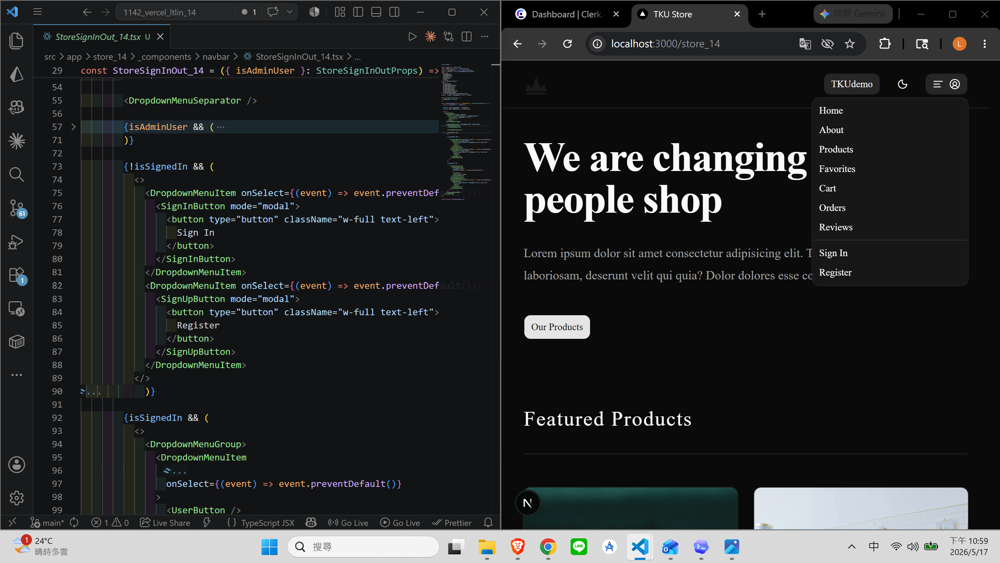
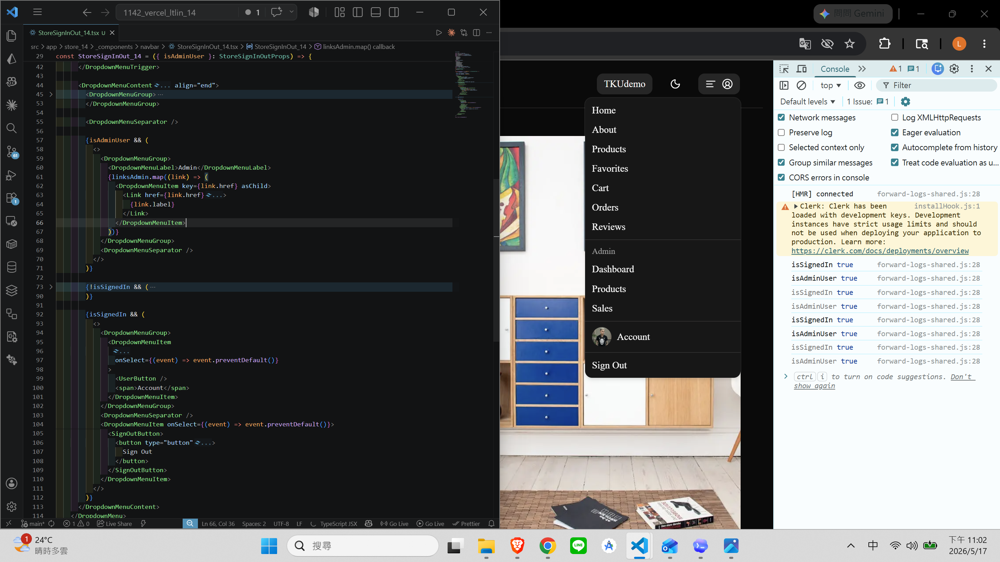
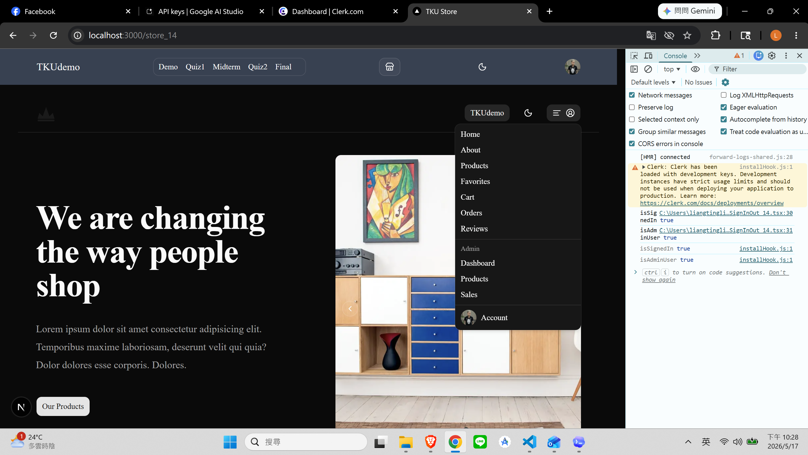
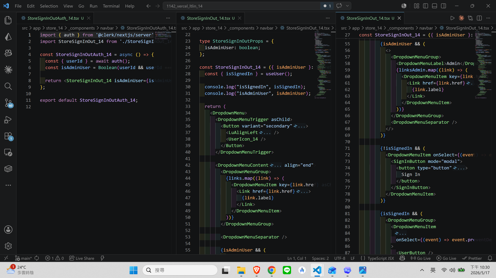
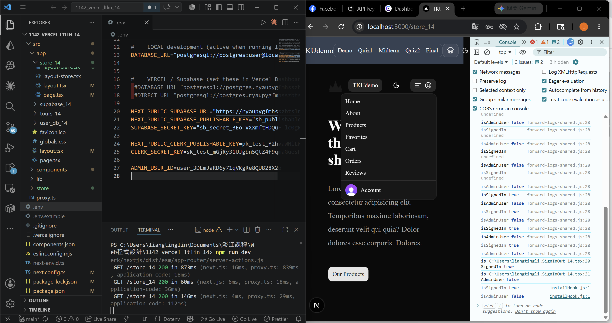
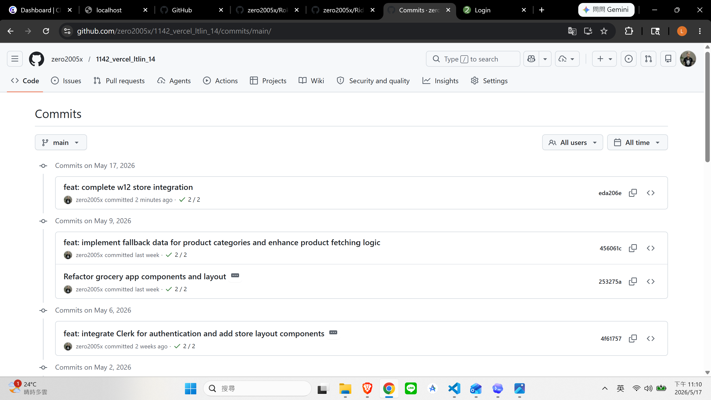

[Github URL](https://github.com/zero2005x/1142_2N_DEMO_LTLIN_14)
[Vercel URL](https://1142-vercel-ltlin-14.vercel.app/)

### W12-P1: Add 4 initial product data to Supabase
 
#### => npx prisma db seed to add 4 data
 


```
a98de5c zero2005x       Sat May 16 16:57:25 2026 +0800  W11-P1: Clerk Setup and test
```

### W12-P2: Sign In and Sign Out with links
 
#### => Not signed in, show Login and Register
 

 
#### => already signed in, show links, linksAdmin, and Logout
 


```

```

### W12-P3: Check isAdminUser
 
#### => isAdminUser is true, shown in Chrome
 

 
#### => related code for checking isAdminUser
 

 
#### => isAdminUser is false
 

 


```

```


### w12-logs: git logs of w12


