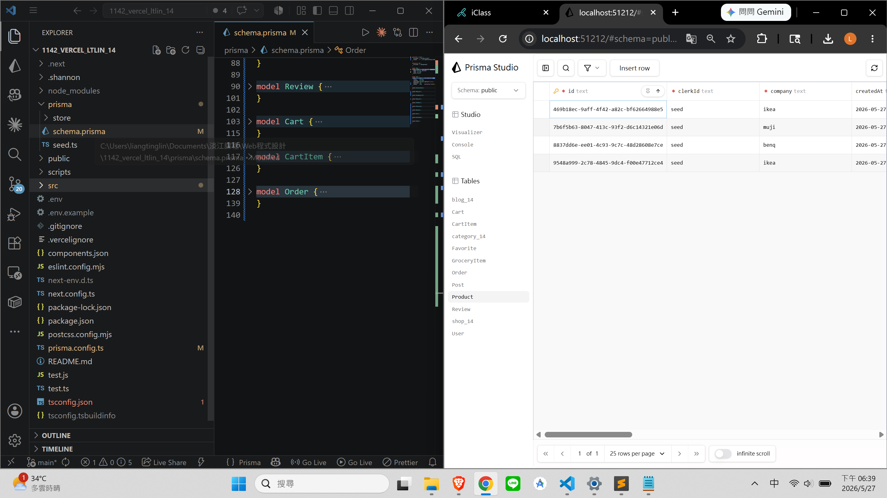
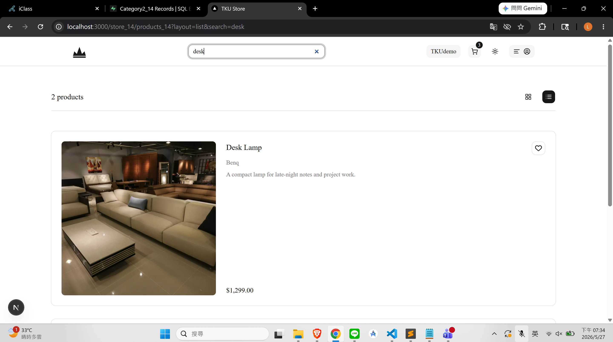
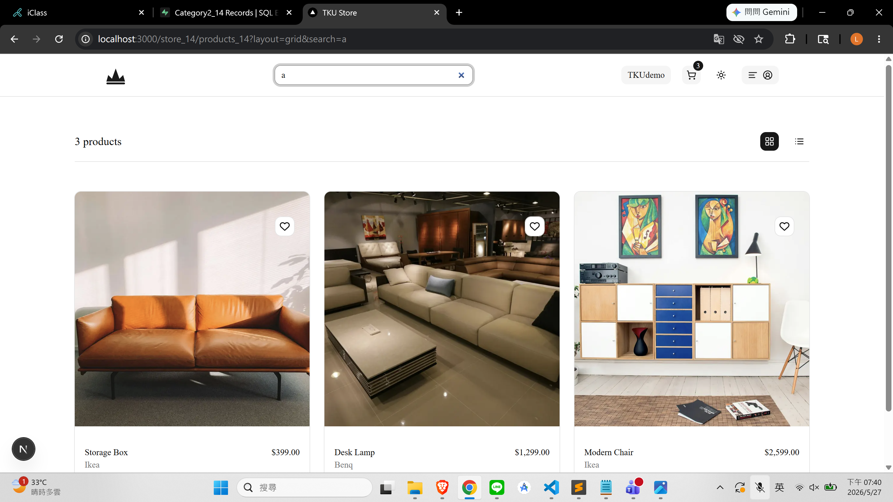
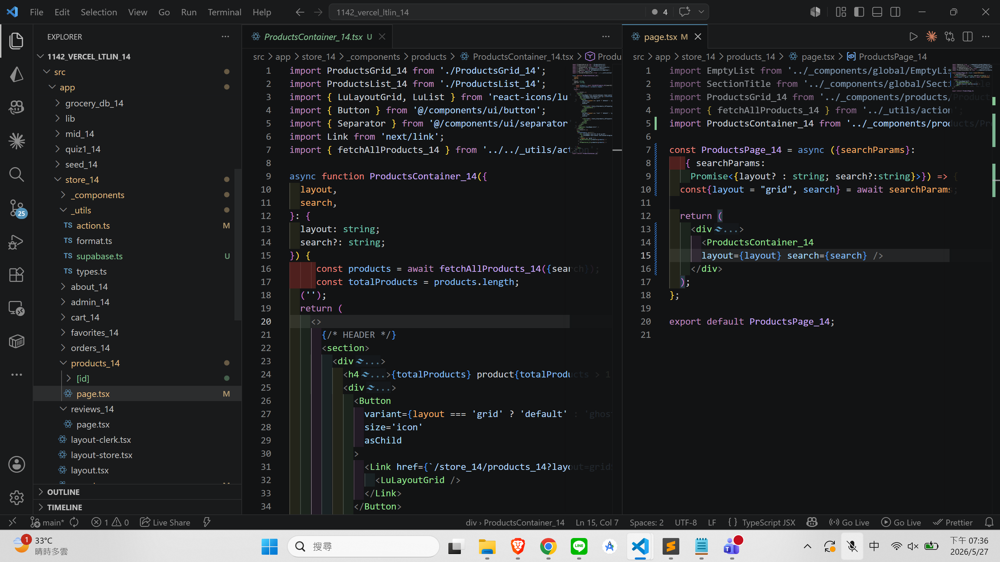
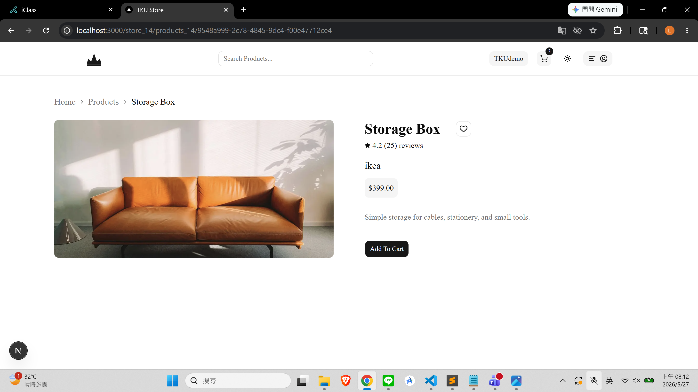
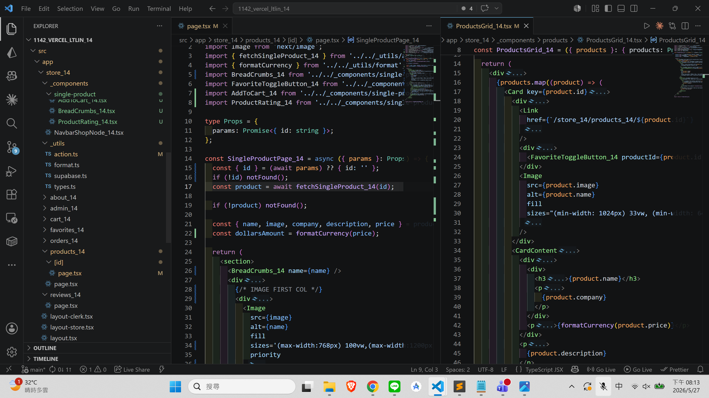
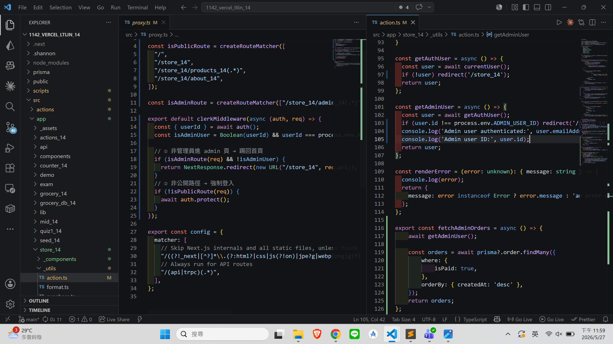
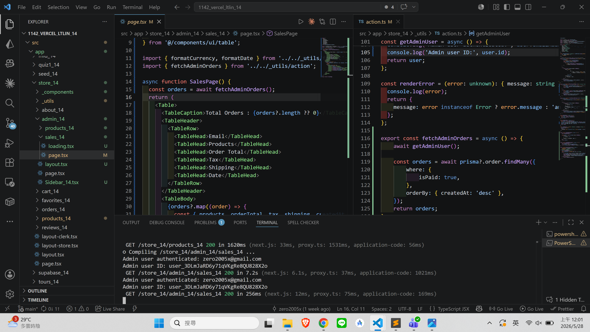
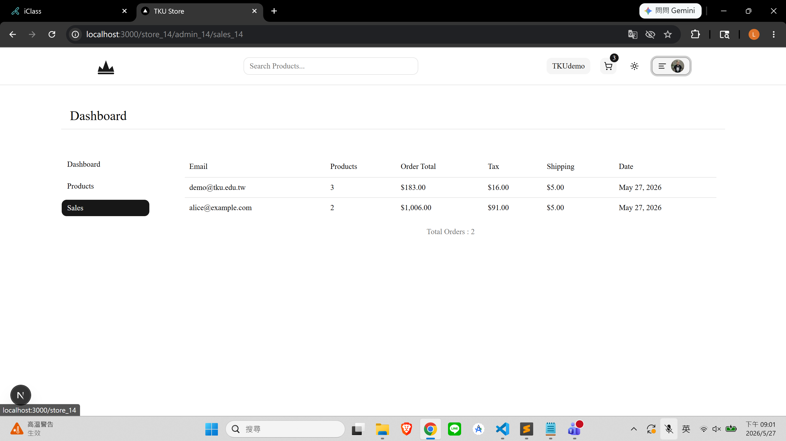
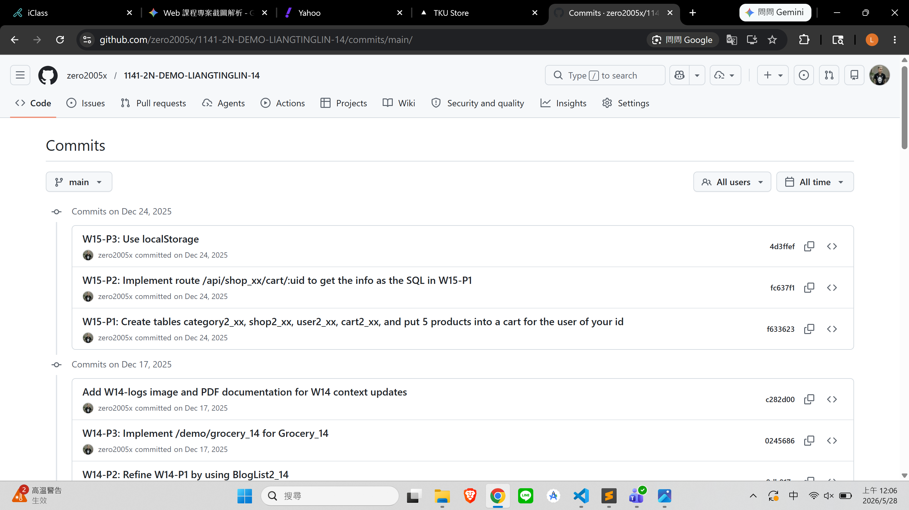

[Github URL](https://github.com/zero2005x/1142_2N_DEMO_LTLIN_14)
[Vercel URL](https://1142-vercel-ltlin-14.vercel.app/)

### W14-P1: update 6 models used in store project into Supabase
 
#### => npx prisma db push
 


```
e680d48 zero2005x       Wed May 27 18:41:03 2026 +0800   W14-P1: update 6 models used in store project into Supabase
```


### W14-P2: Implement search
 
#### => params: "layout=list&search=desk"
 

 
#### => params: "layout=grid&search=a"
 

 
#### => related code for "layout=grid&search=c"
 


```
4fae3b5 zero2005x       Wed May 27 19:42:47 2026 +0800  W14-P2: Implement search
```

### W14-P3: Show product details
 
#### => Chrome output
 

 
#### => related code
 

 


```
79cfba3 zero2005x       Wed May 27 20:14:34 2026 +0800  W14-P3: Show product details
```


### W14-P4: for admin user to show the sales table for the route /store_xx/admin_xx/sales_xx
 
#### => proxy.tsx and getAdminUser
 

 
#### => code for checking admin user
 

 
#### => Chrome display
 


```

```

### W14-logs: git logs of W14


